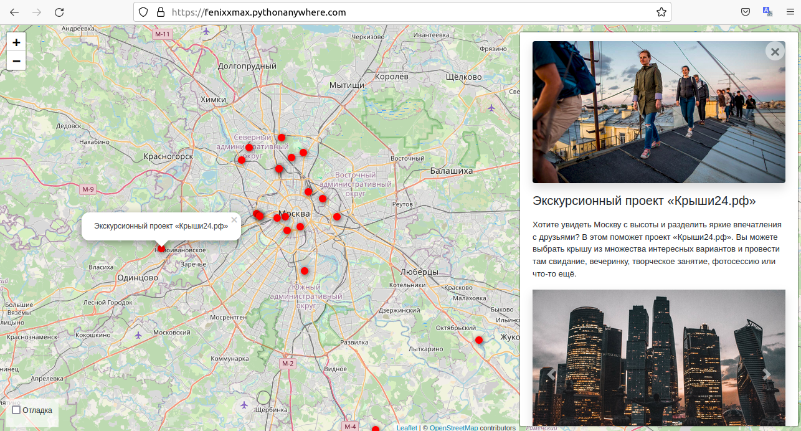

Это проект-сайт для отметок интересных мест на интерактивной карте с подробным 
описанием и фотографиями, рабочий сайт
можете посмотреть здесь [https://fenixxmax.pythonanywhere.com/](https://fenixxmax.pythonanywhere.com/).



На сайте присутсвует удобная админ панель. Вы можете легко добавить новые 
локации, описание и картинки. Перетаскиванием
картинок вы можете задать им порядок отображения. Новый картинки можно 
добавить прям с таблицы локаций. Ссылка на 
[админ](https://fenixxmax.pythonanywhere.com/admin/) часть.


Все данные были взяты с сайта [Kudago](https://kudago.com/msk/).

## Установка

Используйте данную инструкцию по установке этого скрипта

1. Установить

```python
git clone https://github.com/Maxim-Pekov/yandex-afisha-django.git
```

2. Создайте виртуальное окружение:

```python
python - m venv venv
```

3. Активируйте виртуальное окружение:

```python
.\venv\Scripts\activate`  # for Windows
```

```python
source./.venv/bin/activate  # for Linux
```

4. Перейдите в `yandex-afisha-django` директорию.

3. Установите зависимости командой ниже:

```python
pip install - r requirements.txt
```

4. Для доступа в админ панель, создайте супер юзера

```python
python3 manage.py createsuperuser
```

* Напишите имя
* Напишите емайл
* Придумайте пароль ( его не будет видно )
* Повторите пароль
* Если пароль слишком легкий, джанга попросит вас подтвердить его создание, нажмите `y`

5. Создайте файл с переменными окружения, пример содержимого ниже:

```python
SECRET_KEY='Ваш секретный код'
DEBUG=True
ALLOWED_HOSTS=127.0.0.1,localhost
DATABASE_ENGINE='django.db.backends.sqlite3'
DATABASE_NAME='db.sqlite3'
```

6. Создайте миграции и базы данных командами ниже:

```python
python manage.py makemigrations
python manage.py migrate
```
7. Запустите сайт командой:

```python
python manage.py runserver
```

8. Что бы загрузить данные (такие же как на примере в БД) из json файла, воспользуйтесь командой ниже:

```python
python manage.py load_place --json_url < GITHUB_URL >
```

Вместо < GITHUB_URL > подставьте RAW адрес одной из локаций, которые вы найдете здесь 
[github.com/devmanorg/places](https://github.com/devmanorg/where-to-go-places/tree/master/places), 
для этого перейдите по ссылке, выберете любую локацию и нажмите RAW

9. В браузере перейдите на странницу `http://127.0.0.1:8000`

## About me

[https://www.linkedin.com/in/maxim-pekov/](https://www.linkedin.com/in/maxim-pekov/)
</br>

[https://t.me/MaxPekov/](https://t.me/MaxPekov/)
</br>

[//]: # (Карточка профиля: )


[//]: # (Статистика языков в коммитах:)

[//]: # (Статистика языков в репозиториях:)


[//]: # (Статистика профиля:)

[//]: # (Данные по коммитам за сутки:)


[//]: # ([![trophy]&#40;https://github-profile-trophy.vercel.app/?username=Maxim-Pekov&#41;]&#40;https://github.com/ryo-ma/github-profile-trophy&#41;)

